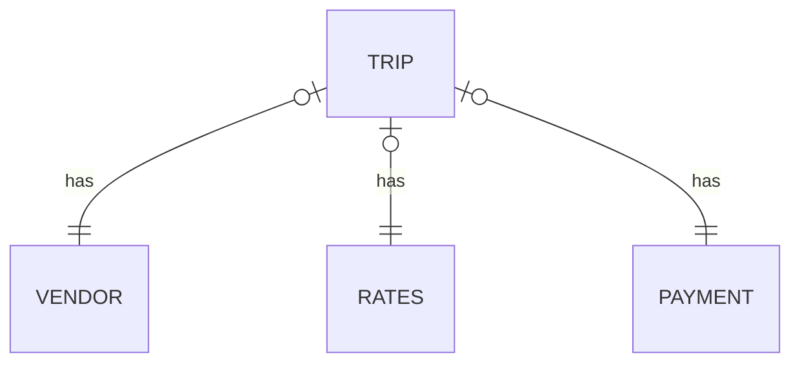

# Apache Spark

### Skills and tools
`Yandex.Cloud` `S3` `HDFS` `PySpark` `CLI` `Shell` `Hadoop Cluster Administration`                                            

---
### Task: create a showcase of the following type:

| Number of the week | Payment type | Average check | The ratio of tips to the cost of the trip |
|:-------------------|:-------------|:--------------|:------------------------------------------|
| 8                  | Cash         | 	8.35         | 0.113323345634572907                      |

Data schema:

### Input-data: taxi_data.csv:
1,2020-04-01 00:41:22,2020-04-01 01:01:53,1,1.20,1,N,41,24,2,5.5,0.5,0.5,0,0,0.3,6.8,0
Learn more about the data source [*here*][1]

---

### Progress of work:
1. *Deploying a Hadoop cluster* using a `Yandex.Cloud` solution :
2. *Creating a bucket* using a `S3` Yandex.Cloud solution.
3. [*Downloading data*][2] (database) to created `s3` bucket using `distcp`.
4. [*Initiating Spark job*][3]

[1]:https://registry.opendata.aws/nyc-tlc-trip-records-pds/
[2]:https://github.com/Amboss/portfolio_projects/blob/master/apache_spark/scripts/download.sh
[3]:https://github.com/Amboss/portfolio_projects/blob/master/apache_spark/scripts/spark.py
