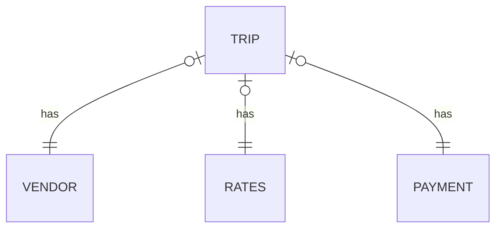

# Docker / Kafka / Spark / Zookeeper

### Skills and tools
`Yandex.Cloud` `Kafka` `SparkStreaming` `Docker-compose` `ZooKeeper` `GreenPlum`

---
#### Task: create a showcase using Docker, Kafka, Spark, Zookeeper of the following type:

| Number of the week | Payment type | Average check | The ratio of tips to the cost of the trip |
|:-------------------|:-------------|:--------------|:------------------------------------------|
| 8                  | Cash         | 	8.35         | 0.113323345634572907                      |

Data schema:

###Input-data: taxi_data.csv:

1,2020-04-01 00:41:22,2020-04-01 01:01:53,1,1.20,1,N,41,24,2,5.5,0.5,0.5,0,0,0.3,6.8,0

Learn more about the data source [*here*][1]

---
### Progress of work:
1. *Deploying a Hadoop cluster* using a `Yandex.Cloud` solution :
2. *Creating a bucket* using a `S3` Yandex.Cloud solution .
3. [*Deploying Docker container*][2] with the latest versions of distributions `zookeeper`, `kafka`
4. [*Downloading data*][3] (database) to created `s3` bucket using `distcp`.
5. [*Initiating Kafka producer*][4]
6. [*Initiating Spark job*][5]

[1]:https://registry.opendata.aws/nyc-tlc-trip-records-pds/
[2]:https://github.com/Amboss/Docker_kafka_spark/blob/master/docker/docker-compose.yml
[3]:https://github.com/Amboss/Docker_kafka_spark/blob/master/scripts/download.sh
[4]:https://github.com/Amboss/Docker_kafka_spark/blob/master/scripts/data_producer.py
[5]:https://github.com/Amboss/Docker_kafka_spark/blob/master/scripts/streaming_job.py
